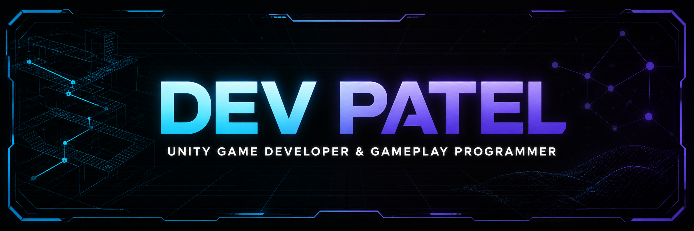
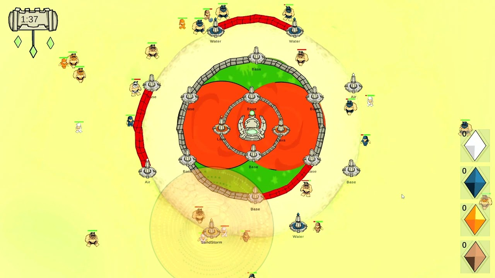
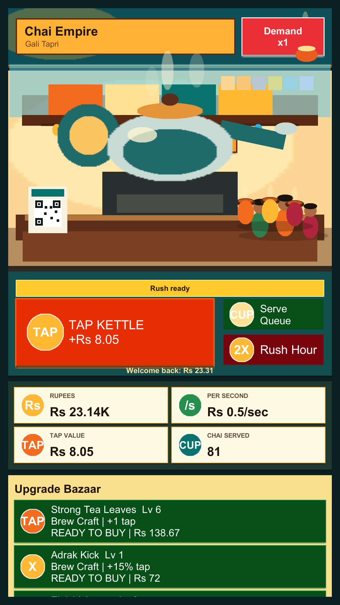
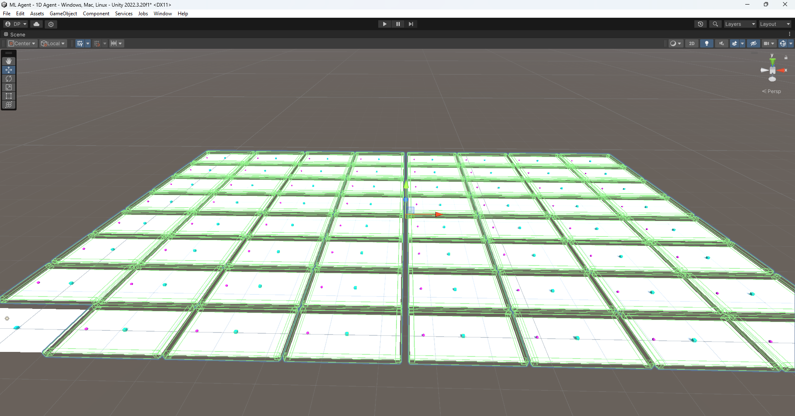

  

  I build systems-driven games, gameplay mechanics, AI experiments, and AR/VR experiences.

  
  

  <a href="mailto:dev.p2349@gmail.com">Email</a>
  &nbsp;&middot;&nbsp;
  <a href="https://www.linkedin.com/in/dev-patel-a46b951a9/">LinkedIn</a>
  &nbsp;&middot;&nbsp;
  <a href="https://devp2349.wixsite.com/dev-patel-portfoli">Portfolio</a>
  &nbsp;&middot;&nbsp;
  <a href="https://dev0910.itch.io/">itch.io</a>

## About Me

I am a Unity Game Developer and Gameplay Programmer who enjoys turning design ideas into readable, reusable systems. My public work covers arcade games, tower defence, survival and base building, incremental economies, Minimax opponents, and reinforcement and imitation learning with Unity ML-Agents.

I currently work as a Unity Game Developer at Playing Human Studio and teach Unity AR/VR as visiting faculty. I care about responsive mechanics, balanced progression, clear architecture, and honest documentation that makes a project easy to understand.

## Core Toolkit

  
  
  
  
  
  
  

- Gameplay systems, game AI, progression, persistence, and balancing
- Level and mechanic design, rapid prototyping, and collaborative game-jam development
- Unity C#, Unreal Engine Blueprints and C++, Git, ML-Agents, and AR/VR instruction

## Featured Work

<table>
  <tr>
    <td width="50%" valign="top">
      
      
<strong><a href="https://github.com/Dev0910/Tattva-Shila">Tattva Shila</a></strong>

      
A four-day collaborative game-jam project where elemental towers combine into stronger defences. I served as Lead Game Developer.

      
Unity 2022 LTS · C# · Tower defence · Released for WebGL and Windows

      
<a href="https://dev0910.itch.io/tattva-shila">Play in browser</a>

    </td>
    <td width="50%" valign="top">
      
      
<strong><a href="https://github.com/Dev0910/Undying-Havoc">Undying Havoc</a></strong>

      
A 2D survival and base-defence game with day/night waves, resource gathering, construction, upgrades, and object pooling.

      
Unity 2022 LTS · C# · Team project · Included Windows build

      
<a href="https://www.youtube.com/watch?v=iRFnBLJYcYs">Watch gameplay</a>

    </td>
  </tr>
</table>

<table>
  <tr>
    <td width="50%" valign="top" align="center">
      
      
<strong><a href="https://github.com/Dev0910/ChaiEmpire">Chai Empire</a></strong>

      
An Android incremental clicker about growing a street chai stall through upgrades, automation, locations, offline earnings, and prestige.

      
Unity 6 · C# · Prototype · 33 EditMode tests

    </td>
    <td width="50%" valign="top" align="center">
      
      
<strong><a href="https://github.com/Dev0910/Unity-ML-Agents-Food-Collector">ML-Agents Food Collector</a></strong>

      
A reinforcement and imitation-learning sandbox with repeated training arenas, PPO, GAIL, behavioral cloning, and a recorded demonstration.

      
Unity 2022 LTS · C# · ML-Agents · Learning project

      
<a href="https://www.youtube.com/watch?v=i1orPLHQBbU">Watch the test video</a>

    </td>
  </tr>
</table>

## More Projects

| Project | What it demonstrates | Status |
| --- | --- | --- |
| [Super Tic Tac Toe](https://github.com/Dev0910/Super-Tic-Tac-Toe) | Local two-player matches and a Minimax computer opponent with difficulty selection | Classic mode playable; super-board and ML Agent work in progress |
| [Ping Pong](https://github.com/Dev0910/Ping-Pong) | Position-based rebounds, three difficulty modes, and persistent local leaderboards | Unity source project; no packaged build |
| [Vicket](https://github.com/Dev0910/Vicket) | VR cricket project exploration | Forked repository |

## Experience & Recognition

- Unity Game Developer at **Playing Human Studio** since December 2024, including work connected with [Premier Cricket GO! (Beta)](https://play.google.com/store/apps/details?id=com.playingHumanGames.premierCricketGO1).
- Visiting Faculty for **Unity AR/VR at Thakur College** from 2026.
- Winner of **three game jams**, including two collaborations with IGDC.
- Recipient of the **Best Board Game Award** at the Seamedu Awards 2023.
- Former President of the **ADYPU Gaming Club**.

## GitHub Snapshot

  
  

## Let's Build Something That Plays Well

I am open to Unity Game Developer and Gameplay Programmer roles. If you are building a game that needs strong mechanics, maintainable systems, or thoughtful progression, [send me an email](mailto:dev.p2349@gmail.com) or explore the longer-form work on my [portfolio](https://devp2349.wixsite.com/dev-patel-portfoli).
