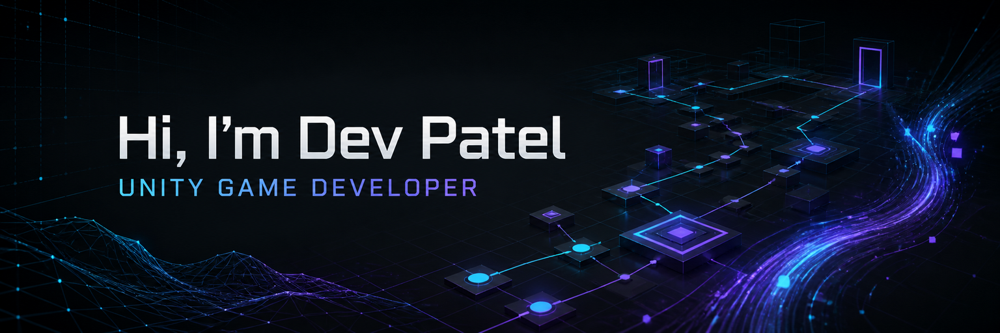
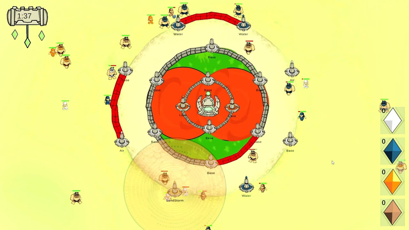
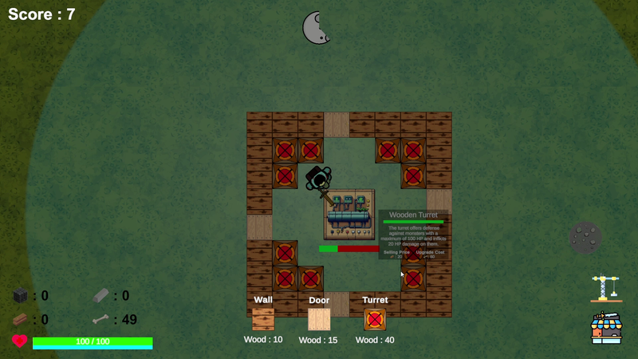
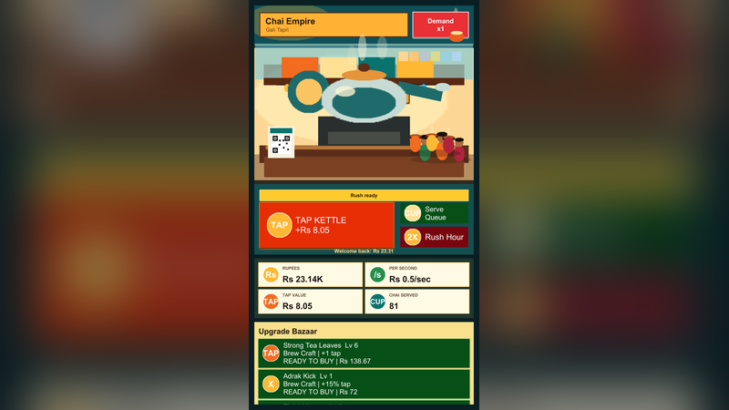
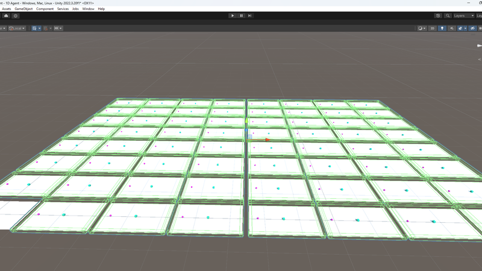
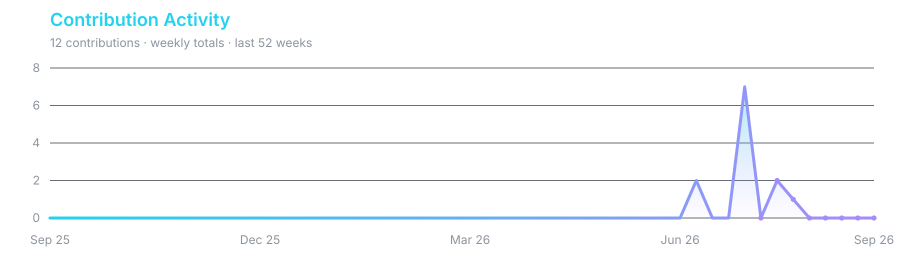

  

  

  
  
  
  

<strong>Open to Unity Game Developer and Gameplay Programmer roles.</strong>

## About Me

I am a Unity Game Developer and Gameplay Programmer who turns design ideas into readable, reusable systems. My public work spans tower defence, survival and base building, incremental economies, Minimax opponents, reinforcement learning, and immersive AR/VR experiences.

I care about responsive mechanics, balanced progression, clear architecture, and projects that are easy for both players and teams to understand.

## Current Focus

<table>
  <tr>
    <td width="50%" valign="top">
      <strong>Gameplay Systems</strong>  
      Player feel, combat loops, progression, persistence, game AI, and rapid mechanic prototyping.
    </td>
    <td width="50%" valign="top">
      <strong>AI &amp; Immersive Tech</strong>  
      Unity ML-Agents experiments, AR/VR interaction design, and production-minded tools for game teams.
    </td>
  </tr>
</table>

## Featured Projects

<table>
  <tr>
    <td width="50%" valign="top">
      
      <h3 align="center"><a href="https://github.com/Dev0910/Tattva-Shila">Tattva Shila</a></h3>
      
Four-day game-jam tower defence built around elemental tower combinations.

      
<strong>Role:</strong> Lead Game Developer · <strong>Stack:</strong> Unity, C# · <a href="https://dev0910.itch.io/tattva-shila">Play</a>

    </td>
    <td width="50%" valign="top">
      
      <h3 align="center"><a href="https://github.com/Dev0910/Undying-Havoc">Undying Havoc</a></h3>
      
2D survival and base defence with day/night waves, construction, upgrades, and object pooling.

      
<strong>Stack:</strong> Unity, C# · <a href="https://www.youtube.com/watch?v=iRFnBLJYcYs">Gameplay</a>

    </td>
  </tr>
  <tr>
    <td width="50%" valign="top">
      
      <h3 align="center"><a href="https://github.com/Dev0910/ChaiEmpire">Chai Empire</a></h3>
      
Unity 6 Android clicker about growing a street chai stall through upgrades, automation, and prestige.

      
<strong>Stack:</strong> Unity 6, C#, Android · <strong>Quality:</strong> 33 EditMode tests

    </td>
    <td width="50%" valign="top">
      
      <h3 align="center"><a href="https://github.com/Dev0910/Unity-ML-Agents-Food-Collector">ML-Agents Food Collector</a></h3>
      
Food-collection learning sandbox with PPO, GAIL, behavioral cloning, and recorded demonstrations.

      
<strong>Stack:</strong> Unity, C#, ML-Agents · <a href="https://www.youtube.com/watch?v=i1orPLHQBbU">Demo</a>

    </td>
  </tr>
</table>

## More Projects

| [Super Tic Tac Toe](https://github.com/Dev0910/Super-Tic-Tac-Toe) | [Ping Pong](https://github.com/Dev0910/Ping-Pong) | [Vicket](https://github.com/Dev0910/Vicket) |
| :---: | :---: | :---: |
| Local multiplayer and a Minimax opponent | Three difficulties and persistent local leaderboards | Forked VR cricket project |

## Tech Stack

<table>
  <tr>
    <td width="50%" align="center" valign="top">
      <strong>Game Development</strong>  
       
      Unity · Unreal Engine · Blueprints · Level &amp; mechanic design
    </td>
    <td width="50%" align="center" valign="top">
      <strong>Programming</strong>  
       
      C# · C++ · Object-oriented architecture · Reusable systems
    </td>
  </tr>
  <tr>
    <td width="50%" align="center" valign="top">
      <strong>AI &amp; Gameplay Systems</strong>  
      
       
      Reinforcement learning · Game AI · Progression · Persistence
    </td>
    <td width="50%" align="center" valign="top">
      <strong>Tools &amp; Platforms</strong>  
       
      
    </td>
  </tr>
</table>

## Experience & Recognition

<table>
  <tr>
    <td width="50%" valign="top">
      <strong>Experience</strong>
      <ul>
        <li><strong>Unity Game Developer</strong>, Playing Human Studio — Dec 2024 to present</li>
        <li>Contributed to <a href="https://play.google.com/store/apps/details?id=com.playingHumanGames.premierCricketGO1">Premier Cricket GO! (Beta)</a></li>
        <li><strong>Visiting Faculty</strong> for Unity AR/VR at Thakur College</li>
      </ul>
    </td>
    <td width="50%" valign="top">
      <strong>Recognition</strong>
      <ul>
        <li>Winner of three game jams, including two IGDC collaborations</li>
        <li>Best Board Game Award — Seamedu Awards 2023</li>
        <li>Former President — ADYPU Gaming Club</li>
      </ul>
    </td>
  </tr>
</table>

## GitHub Analytics

<table>
  <tr>
    <td width="50%"></td>
    <td width="50%"></td>
  </tr>
</table>

  

## Let's Build Something That Plays Well

  I am open to studio roles where thoughtful mechanics, maintainable systems, and player experience matter. 
  <a href="mailto:dev.p2349@gmail.com"><strong>Start a conversation</strong></a>
  &nbsp;·&nbsp;
  <a href="https://devp2349.wixsite.com/dev-patel-portfoli">View portfolio</a>

---

DEV0910 // GAMEPLAY SYSTEMS // AI &amp; IMMERSIVE TECH

